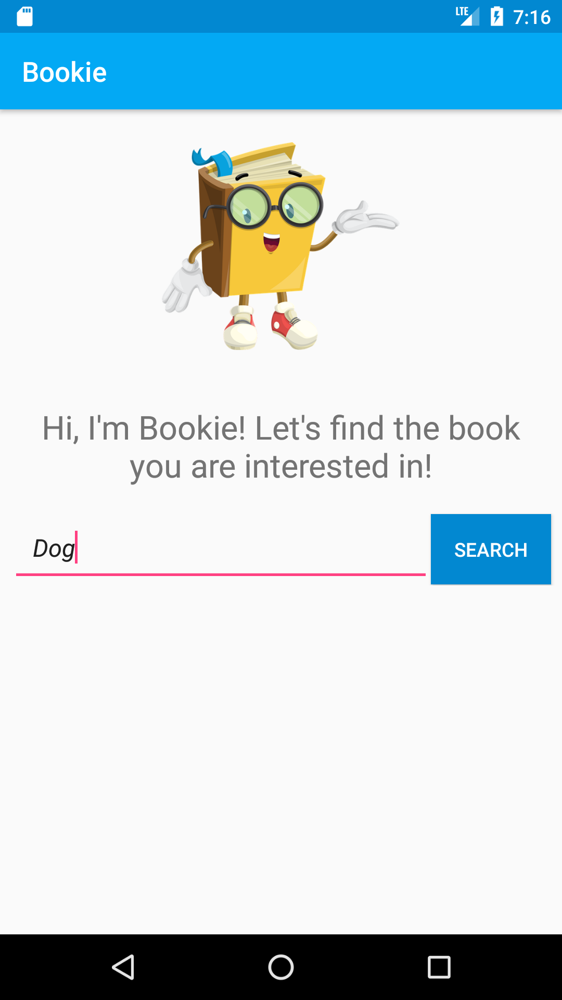
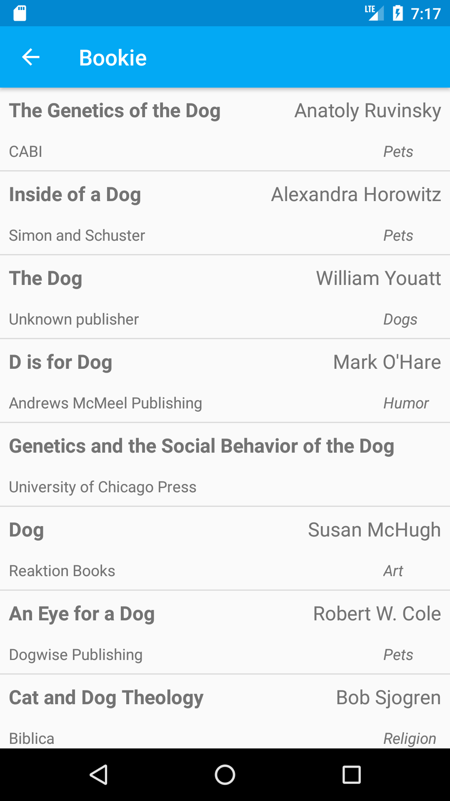
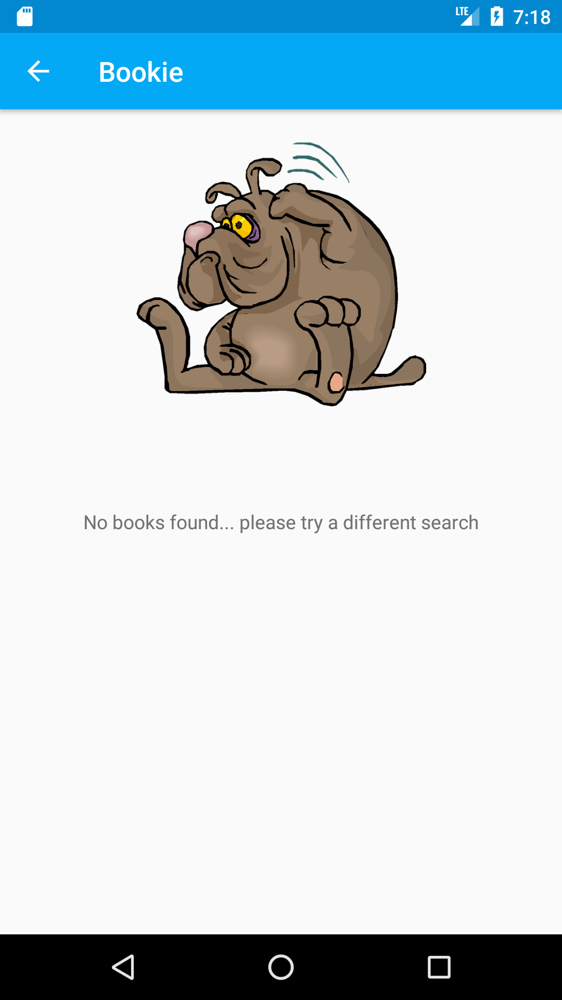

# Bookie
A book listing app in Android, for the purpose of the Android Scholarship hackathon, as well as for the BookListingApp project of the Android Basics Nanodegree program
  

<table width="100%">
<th">Screenshots</th>
</tr>
<tr>
<td>  </td>
<td>  </td>
<td>  </td>
</tr>
</table>
  

## Contents
The app takes an input query from the user and fetches relevant books using the *Google Books API*
  

## Details
It fetches data from the API in **JSON** format, returns a list of all relevant results or, if the query was unsuccessful due to wrong user input, it informs the user to try a different search.
  

## Built with
Android Studio
